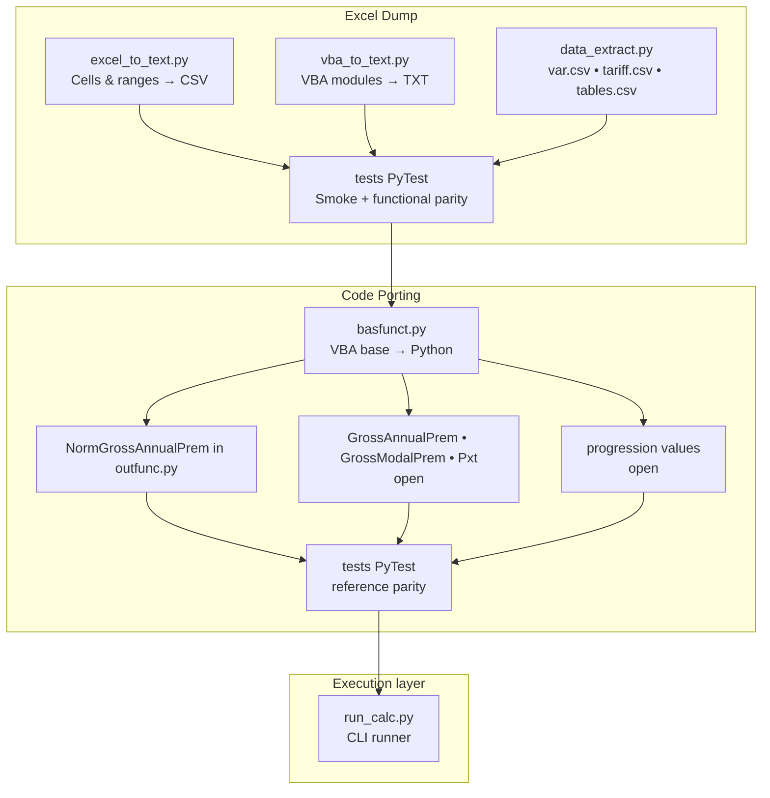

# Excel Tariff Calculator → Python Calculator (LLM Proof of Concept)


*ver. 0.08 (2026-01-28)*

This repository accompanies the video / webinar of the DAV working group.

Excel-based tariff calculators are ubiquitous in everyday actuarial work – but complex formulas, scattered VBA macros, and limited collaboration capabilities slow down innovation and maintainability.

Thanks to powerful libraries, Python provides a scalable and easily maintainable alternative with clearly structured code and seamless integration into modern workflows. This video demonstrates how a typical Excel tariff calculator can be translated into Python using a Large Language Model (LLM) – in this case ChatGPT. Two different approaches are presented.

**“Porting reference calculators with Large Language Models”**  
The goal is to reproducibly transfer a classical life insurance Excel tariff calculator into **pure Python code** – using two different workflows (“crafted” vs. “industrial”).

---

## Table of Contents
1. [Project overview](#project-overview)  
2. [Repository structure](#repository-structure)  
3. [Workflows](#workflows)  
   * [Arno’s “crafted” approach](#arnos-crafted-approach)  
   * [Bartek’s “industrial” approach](#barteks-industrial-approach)  
4. [Getting started](#getting-started)  
5. [Usage](#usage)  
6. [Tests & reports](#tests--reports)  
7. [Contributing](#contributing)  
8. [License](#license)

---

## Project overview

* **Problem:** Excel tariff calculators are quick to build, but hard to maintain and barely CI-ready.  
* **Solution:** Use Large Language Models to automatically migrate Excel formulas, VBA modules, and tabular data into Python code.  
* **Value:**  
  * transparent, modular source code  
  * automated tests & continuous integration  
  * foundation for future product and portfolio migrations in life insurance IT

The two approaches differ mainly in their **degree of automation** and **tool stack**:

| Aspect                   | Crafted (Arno) | Industrial (Bartek) |
|--------------------------|----------------|---------------------|
| LLM input                | VBA source & screenshot | Full Excel dump as text |
| Manual steps             | Screenshot, copy & paste of formulas | none |
| Objective                | fast PoC       | fully automatable workflow |
| Key insight              | LLM recognizes cells surprisingly well | context limit currently the bottleneck |

---

## Repository structure

```text
dev/
├─ Arno/                 # Crafted workflow
│  ├─ input/             # Chat history (prompts only), screenshot, original Excel
│  └─ output/            # Python code generated by ChatGPT
├─ Bartek/               # Industrial workflow
│  ├─ input/             # Optimized prompts, original Excel
│  └─ output/            # root: i/o and python modules
│     └─ tests/          # PyTest fixtures & smoke tests
├─ README.md             # *this file*
└─ requirements.txt      # Software specification
```

*(For new files, please keep the same directory depth.)*

---

## Workflows

### Arno’s “crafted” approach

*Goal:* **Rapid prototyping** – with as few prompts as possible and using a reasoning model.

Since the model cannot process Excel files directly, the components of the input file `Tarifrechner_KLV.xlsm` are handled separately. The task is split into three steps (plus a fourth step for value comparison).

| Step | Description | Chat log | Generated files | 
| ---- | ----------- | -------- | --------------- |
| 1    | Transfer mortality tables from Excel into an XML file | Chat_1_Convert_Excel_to_XML | `MortalityTables.xml` |
| 2    | Translate VBA modules (`mConstants`, `mCommValues`, `mPresentValues`) into Python | Chat_2_Translate_VBA_to_Python | `constants.py`  `commvalues.py` `presentvalues.py`|
| 3    | Map worksheet `Calculation` as a CLI program (screenshot + formulas as text). | Chat_3_Generate_Calculator_and_Verification (Prompts 5–7) | `premium_and_progress_values.py` `tariff_calculator.py` |
| 4    | Value comparison Excel ↔ Python. | Chat_3_Generate_Calculator_and_Verification (Prompt 8) | `compare.py` |

---

### Bartek’s “industrial” approach

*Workflow goal:* **100% script-driven migration** – no manual intermediate steps.



*Workflow phases:*

| Section | Meaning |
|--------|---------|
| **Excel dump & preprocessing** | Automated extraction scripts (steps 1–4) |
| **Code porting** | Translation of logic into Python (steps 5–6, 8) |
| **Execution layer** | End-user interface via CLI (step 7) |

*Status:* ✅ completed – steps 1–7 • ⏳ open – step 8 (porting of the roll-forward formulas).

---

## Getting started

### Option B – GitHub Codespaces (browser IDE)

1. Open the repository → **Code ▸ Codespaces ▸ Create**.  
2. After startup, the VS Code web IDE opens.  
3. Open the terminal and run, for example:
   ```bash
   pytest -q
   python Bartek/output/run_calc.py --help
   ```

### Option C – Local setup with Docker Desktop + VS Code

**Prerequisites**  
- Docker Desktop installed (Windows: **Linux containers** enabled – if the menu shows “Switch to Windows containers…”, everything is correct).  
- Visual Studio Code + **Dev Containers** extension (`ms-vscode-remote.remote-containers`).  
- Git CLI.

**Setup (Windows example)**

```bash
# Create and enter project directory
cd C:/dev/LLM_seminar

# Clone repo and open
git clone https://github.com/bartlmac/portxlpy-seminar-2026-02-eaa.git
cd portxlpy-seminar-2026-02-eaa
code .
```

**In VS Code:** `F1` → **Dev Containers: Reopen in Container**  
**Smoke test (inside container):**
```bash
pytest -q    # Expected: 4 passed
```

> **Note:** `postCreateCommand` only runs on **first build** – if needed: `F1` → **Dev Containers: Rebuild and Reopen in Container**.

**Troubleshooting (local):**
```bash
# Stop project and remove volumes
docker compose down -v

# Optional: free disk space – remove unused images (use with care!)
docker image prune -a
```

> **Warning:** `docker image prune -a` removes **all unused** images.

---

## Usage

### Arno’s CLI runner
```bash
# Main calculation
cd Arno/output
python tariff_calculator.py

# Value comparison Excel
python compare.py
# Or optional quick test via pytest
pytest -q
```

### Bartek’s CLI runner
```bash
# Select functions via --funcs
cd Bartek/output
python run_calc.py
# Value and functional tests
pytest -q
```

---

## Contributing

Pull requests are welcome. Please note:

1. Create an issue for larger changes.  
2. Write (or update) tests for new features.

---

## Educational Purpose & Disclaimer

This repository contains **educational example code** created for workshops
and seminars.

- The code is **not intended for production use**
- It does **not constitute an actuarial recommendation**
- It is **not an official repository of the DAV**
- No guarantee is given for correctness, completeness, or fitness for any
  particular purpose

Use at your own risk.

--- 

## License

MIT License. See the LICENSE file for details.

This repository contains educational example code created by Bartlomiej Maciaga and Arno Rasch. It is not an official publication of the DAV and does not represent any actuarial standard or recommendation.


---

**Contact:**  
*Bartlomiej Maciaga* – <bartlomiej.maciaga@hotmail.com>  
*Dr. Arno Rasch* – <arno.rasch@vtmw.de>
